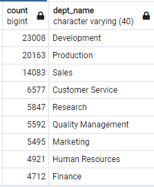

# Pewlett Hackard Analysis

## Project Overview
Pewlett Hackard is looking toward the future as baby boomers are retiring at a rapid rate.  They are offering retirement packages to eligible employees and also looking to prepare for several vacancies that will need to be filled as a result of retirements.  Pewlett Hackard had been using many excel files along with VBA but has recently decided to upgrade to SQL and build an employee database.  Using SQL, the number of retiring employees by title and identifying employees who are eligible to participate in a new mentorship program are needed.

## Purpose
It must be determined how many of each role are eligible for retirement.  Then to assist in the creation of a mentorship program designed to help fill these positions, employees eligible for this program need to be identified.

## Resources
- PostgresSQL version 11
- PgAdmin 4 version 5.7

## Results

- To determine the number of employees by title who are eligible for retirement, a retirement titles table was created for employees with a birth date between January 1, 1952 and December 31, 1955.  However, due to several employees holding different titles throughout the years an Unique Titles table was created to remove duplicate employee entries and obtain the most recent position held.  From the Unique Titles table, it is then possible to perform a count on the employees and store the information in the Retiring Titles table.


- Of the 90,398 positions who are eligible for retirement, 64% hold senior level positions.  Losing these positions without an adequate succession plan would likely create a huge knowledge gap for the company and lack of leadership for the departments.

- On the opposite side, there are only two managers who appear eligible for retirement.  Pewlett Hackard will need to investigate this further whether the manager positions within the company are held by younger individuals who are not yet nearing retirement or whether we have managers who were born prior to January 1, 1952 and we need to expand our birth date range for this position.  It may also be possible that there is a disproportionate ratio of managers to staff.

- To help with the tsunami of impending retirements, Pewlett Hackard wants to start a mentorship program.  A membership eligibility table has been created that consists of current employees who were born in 1965.  Below is a count of the number of positions who are eligible for the mentorship program:


- Using the birth year criteria of 1965 as an eligibility factor appears arbitrary and does not provide sufficient coverage for the impending tsunami.  With 90,398 positions eligible for retirement, only 1,549 current employees have been identified for the mentorship program.

- With the only criteria for the mentorship program being a current employee born in 1965, the company is not taking into account whether these individuals are ready to take on a new position.  We did not know how much experience they have in their current positions.  


## Summary

-  As Pewlett Hackard's "silver tsunami" begins to make an impact, there are 90,398 roles that will need to be filled using the current criteria.  
- There are enough retirement ready employees in the departments to mentor the next generation of employees.  We can determine which departments might be most affected by the impending silver tsunami by creating a table with retirees and their current departments and then running a query to count the retirees in each department.
```
-- Create table of retirees with their current department numbers
SELECT DISTINCT ON (e.emp_no) e.emp_no,
e.first_name,
e.last_name,
de.dept_no,
de.from_date,
de.to_date
INTO dept_retirees
FROM employees as e
INNER JOIN dept_emp as de
ON e.emp_no = de.emp_no
WHERE e.birth_date BETWEEN '1952-01-01' AND '1955-12-31'
ORDER BY emp_no, de.to_date DESC;
```
```
-- query for count of retirees in each department name
SELECT COUNT(dr.emp_no), d.dept_name
FROM dept_retirees as dr
INNER JOIN departments as d
ON dr.dept_no = d.dept_no
GROUP BY d.dept_name
```



- Without an expansion of the mentorship eligibility factors, Pewlett Hackard will need to execute an extensive external hiring campaign in order to fill positions.  By expanding the criteria to beyond just the birth year of 1965, we can create a greater pool of potential participants for the mentorship program.

```
-- Create membership eligibility table with expanded birth date criteria
SELECT DISTINCT ON (e.emp_no) e.emp_no,
	e.first_name,
	e.last_name,
	e.birth_date,
	de.from_date,
	de.to_date,
	t.title
INTO Mentorship_Eligibility2
FROM employees as e
	INNER JOIN titles as t
		ON (e.emp_no = t.emp_no)
	INNER JOIN dept_emp as de
		ON (e.emp_no = de.emp_no)
WHERE (de.to_date = ('9999-01-01'))
AND (e.birth_date BETWEEN '1960-01-01' AND '1965-12-31')
ORDER BY e.emp_no ASC;
```
```
-- Count of potential participants from expanded mentorship
SELECT COUNT (me.emp_no), me.title
FROM mentorship_eligibility2 AS me
GROUP BY me.title
ORDER BY COUNT (me.emp_no) DESC;
```

